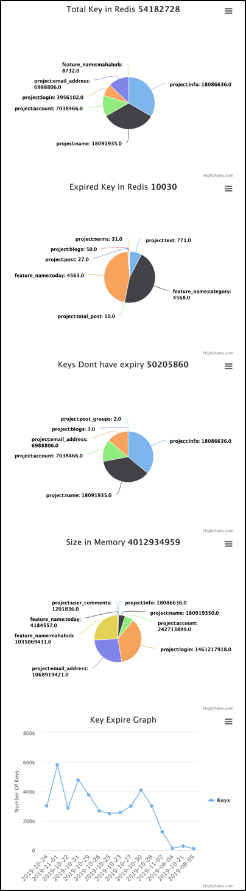

## History of the script
We have an application where we have fairly large number of traffic, so to serving the traffic faster we are using `Redis` widely in our application. We faced too many incidents with ``Redis`` and we were clueless to find out the issue. That is why I created this script to analyze ``Redis AOF`` file, so we can find out what we have within `Redis`.

My personal opninion was redis went to blocking mode because of [latency genrated by key expires](https://redis.io/topics/latency)

So if a lot of keys expired withhin a short period of time you might face latency issue which might affect the application.


## How to Run

Provide the following info

1. AOF file path
2. Deleted key file path [Optional], In this path script will generate file by the key which is expired and later this file can be bused to delete the expires key from redis.

```
    aof_reader = AofReader('appendonly.aof', './delete.txt')
    aof_reader.run()
```


Sample Delete file contents 

```
DELETE user:info:1
DELETE user:info:2
DELETE user:info:3
DELETE user:info:4
DELETE user:info:5
DELETE user:info:6
DELETE user:info:7
DELETE user:info:8
DELETE user:info:9
```

###**For output see the output section, Open reports.html file in a browser.**


## Run Time:
This script may take longer time when the AOF file is large, also depends upon the **RAM**.

**AOF File Size:** 12 GB

**RAM Size where the script run:** 16GB

**Run Time:** 23 minutes

This is sample example but run time may vary based on multiple criteria. 


## Redis Commands
We worked with only the following redis command

1. SET
2. EXPIRE AT
3. DELETE

***Will try to incorporate other commands as well.***


## Key Formats / parse:
we have multiple parts in our keys and separated by **Colon** `:`, our key looks like

1. `key_prefix:settings`
2. `key_prefix:key:[user_id]`
3. `key_prefix:[user_id]:key`

Sometimes **key_prefixes** are **projectname** or **featurename**

This script prepare keys by the following pattern


>     key_config = {
        'key_separator': ':',
        'key_separated_prefix': [
            'project_name',
            'feature_name'
        ]
    }

Key formats used to group the simillar type of keys for example

1. **user:info:123** [123 is the user id]
2. **user:info:124** [124 is the user id]

So all keys of these pattern will be treat as `user:info`


```
  # Detect key pattern
    def key_pattern(self, key):
        parts = key.split(':')
        if len(parts) <= 2:
            return key
        else:
            for idx, val in enumerate(parts):
                if val.isdigit() is True:
                    del parts[idx]
                    return ':'.join(parts)
        del parts[2]
        return ':'.join(parts)
        
```

**valid key:**

1. If the key doesnt have the separator, the whole key will be treated as group.
2. if the key have seperator, it must have two parts seperated by the sparator, otherwise it will be ignored.

```   # parse key
    def parse_the_key(self, line):
        if self.key_config['key_separator'] is None:
            return line
        else:
            key_parts = line.strip().split(self.key_config['key_separator'])
            # key must have two parts
            if (len(key_parts)) < 1 or key_parts[0] not in self.key_config['key_separated_prefix']:
                return False
            else:
                return line
```

## Size

Size is Calculated by the following method, so it might not be equal to actual memory used by Redis. But at least we can have some idea about the key sizes.

```
len(key.encode('utf-8'))
```

## Output

Out put will write in two files

1. fina.json, this file provide all the informations.
2. final.js, this file used by the reports.html file to generate the graphs. 
3. Open reports.html file too see the reports in graphs.

## Screenshot



